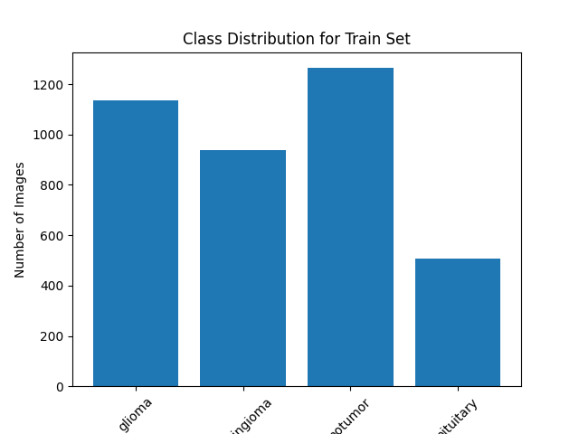
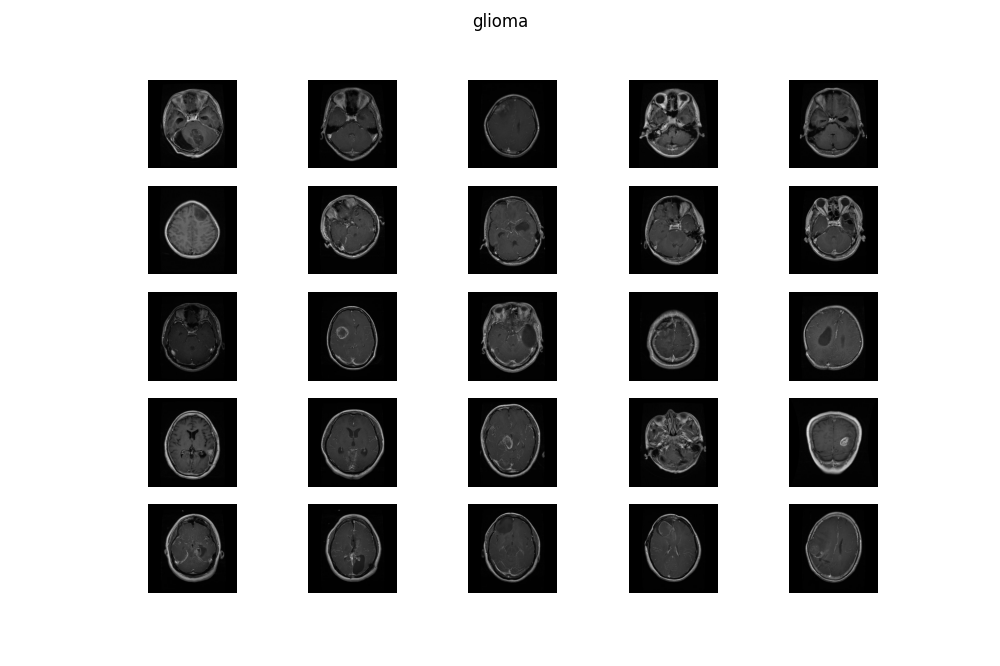
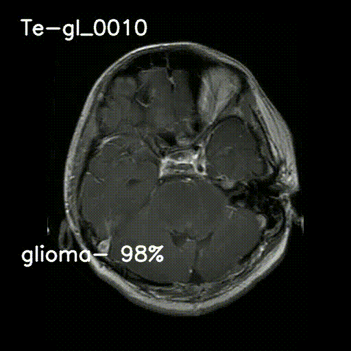

# Convolutional Neural Network for Cancer Detection

# cnn_pytorch.py

## Overview

This Convolutional Neural Network (CNN) model is meticulously crafted for the precise detection of cancerous regions within medical images. Developed using PyTorch, it employs advanced techniques to analyze and classify image data, enabling accurate identification of potential cancerous abnormalities.

## Dataset Preparation

The dataset is meticulously curated and organized into distinct directories, including train, validation (val), and test. It comprises a comprehensive collection of medical images portraying both cancerous and non-cancerous regions. Each image undergoes meticulous preprocessing and transformation, including resizing and conversion to tensors, ensuring optimal compatibility with the model.

## Data Loading and Transformation

Robust data loading mechanisms, facilitated by custom dataset loaders, streamline the process of ingesting image data from the aforementioned directories. These loaders seamlessly integrate data transformations, such as resizing and tensor conversion, ensuring that the input data is impeccably formatted for subsequent model training.

## Model Architecture

At the heart of this system lies a meticulously crafted CNN architecture, designed to extract intricate spatial features from medical images. Leveraging a series of convolutional layers, interspersed with strategic max-pooling operations, the model adeptly learns hierarchical representations of the input data. Employing Rectified Linear Unit (ReLU) activation functions injects essential non-linearity, enhancing the model's capacity to capture complex patterns. The architecture culminates in fully connected layers responsible for high-fidelity classification, yielding probability distributions across distinct classes.

## Training

Powered by the robust Adam optimizer and guided by the Cross-Entropy loss function, the model embarks on an intensive training regimen. Over the course of 20 meticulously orchestrated epochs, it meticulously fine-tunes its parameters to discern subtle nuances within the data. This rigorous training process equips the model with the discerning eye required for accurate cancer detection.

## Evaluation

Following training, the model undergoes a rigorous evaluation process on the meticulously curated test dataset. Leveraging the wealth of insights gleaned during training, the model orchestrates a symphony of predictions, meticulously assessing each image for potential cancerous abnormalities. The resultant accuracy metric serves as a testament to the model's efficacy, providing invaluable insights into its performance.

## Model Persistence

Upon reaching peak performance, the model is meticulously serialized into the ONNX file format, ensuring seamless integration into diverse deployment environments. This portable format enables effortless deployment and facilitates rapid inference on new data, without necessitating the arduous process of retraining.

## Practical Implementation

Harnessing the power of the saved ONNX file, users can seamlessly deploy the model within their medical diagnostic pipelines. Whether employed in clinical settings or research laboratories, this model serves as a beacon of precision, offering unparalleled insights into the detection of cancerous anomalies within medical imagery.

# Data Analysis Script: datanalysis.py

## Overview

The `datanalysis.py` script provides a comprehensive suite of data analysis tools tailored for exploring image datasets. Developed to streamline the exploration process, this script empowers users to visualize class distributions, assess the balance between train and test sets, and inspect sample images from each category. With a user-friendly interface and intuitive functionality, this script serves as an indispensable asset for data scientists and researchers alike.

## Functions

### 1. count_images_per_class(directory)

   - **Description**: Counts the number of images in each class within the specified directory.
   - **Input**: Directory path containing class subdirectories.
   - **Output**: Dictionary mapping class names to the number of images.

### 2. plot_class_distribution(class_counts, title)

   - **Description**: Plots the distribution of images across different classes.
   - **Input**: Dictionary containing class counts and plot title.
   - **Output**: Bar chart illustrating class distribution.

### 3. plot_train_test_ratio(train_counts, test_counts)

   - **Description**: Plots the ratio of images between the train and test sets.
   - **Input**: Dictionaries containing counts of images in the train and test sets.
   - **Output**: Pie chart depicting the ratio of images between train and test sets.

### 4. display_sample_images_per_category(directory)

   - **Description**: Displays a grid of sample images from each category within the specified directory.
   - **Input**: Directory path containing class subdirectories.
   - **Output**: Grid of sample images for visual inspection.

### 5. display_menu()

   - **Description**: Displays the menu options for user interaction.
   - **Input**: None.
   - **Output**: Menu options for selecting data analysis tasks.

### 6. Main Function

   - **Description**: Orchestrates the execution of data analysis tasks based on user input.
   - **Input**: None.
   - **Output**: Executes selected data analysis tasks and provides an option to exit.

## Usage

To utilize the `datanalysis.py` script:

1. Ensure that the image dataset is organized into separate directories for train, validation (val), and test.
2. Execute the script in a Python environment.
3. Follow the on-screen menu prompts to select the desired data analysis task.
4. Visualize class distributions, assess train-test set ratios, and inspect sample images effortlessly.

###Distribution graph of the images for each type of cancer

###Ratio graph of Train and Test

###images of cancer from one type example

# Video Prediction Script: videopredict.py

## Overview

The `videopredict.py` script offers real-time prediction capabilities for analyzing video content, particularly suited for classifying objects or scenes within video frames. Leveraging an ONNX model trained on a deep learning architecture, this script enables seamless inference on video streams, providing insights into the contents of each frame.

## Libraries and Dependencies

- `onnx`: Library for loading and executing ONNX models.
- `onnxruntime`: Runtime engine for executing ONNX models efficiently.
- `numpy`: Fundamental package for numerical computing.
- `torch`: Core library for deep learning and tensor operations.
- `torchvision`: Vision library built on top of PyTorch for computer vision tasks.
- `cv2`: OpenCV library for image and video processing.
- `PIL`: Python Imaging Library for image processing tasks.
- `os`: Operating system interface for interacting with the filesystem.

## Functions

### 1. predict_image(img_tensor, threshold=50)

   - **Description**: Predicts the class label and confidence score for an input image tensor.
   - **Input**: Image tensor (PyTorch tensor) and confidence threshold (default: 50).
   - **Output**: Predicted class label and confidence score.

### 2. process_frame(frame)

   - **Description**: Preprocesses a video frame by converting it to a PyTorch tensor and applying transformations.
   - **Input**: Video frame (NumPy array).
   - **Output**: Preprocessed image tensor.

### 3. draw_prediction(frame, prediction, confidence)

   - **Description**: Draws the predicted class label and confidence score on the input frame.
   - **Input**: Video frame (NumPy array), predicted class label, and confidence score.
   - **Output**: Frame with prediction overlay.

### 4. main()

   - **Description**: Main function to process video frames, predict labels, and visualize predictions.
   - **Input**: None.
   - **Output**: Processed video with prediction overlays.

## Usage

1. Ensure that the `trained_model.onnx` file containing the pre-trained ONNX model is available in the working directory.
2. Execute the `videopredict.py` script in a Python environment.
3. Provide the path to the input video file (e.g., `'output_video.mp4'`) within the script.
4. Run the script, and the processed video with prediction overlays will be saved as `'PREDICT_TYPE_output_video.mp4'`.

###VIDEO DISPLAY 
In the video, each frame depicts a real disease, 
#### Example  Shortcut " GL ", representing " GILOMA " type cancer 
#### OR  Shortcut  " pi ", representing " pituitary " type cancer 
while below, the model's prediction for each image is displayed, offering insights into potential diagnoses. This integration of visual representation and predictive text aids in the accurate assessment of medical conditions, facilitating informed decision-making for healthcare professionals.

