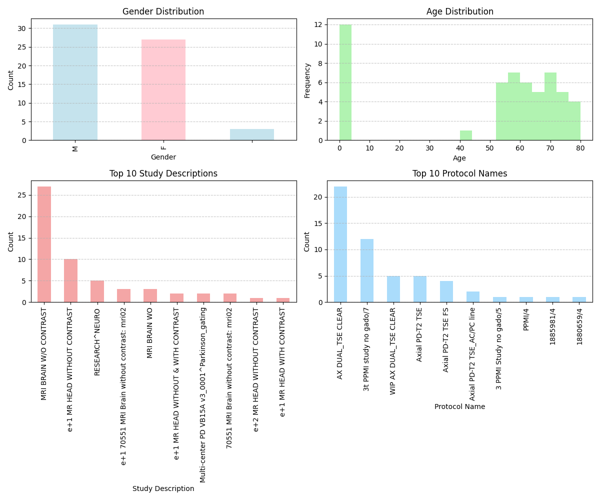
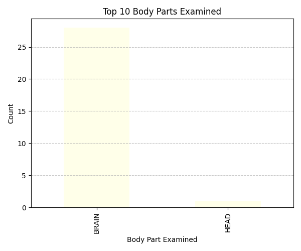
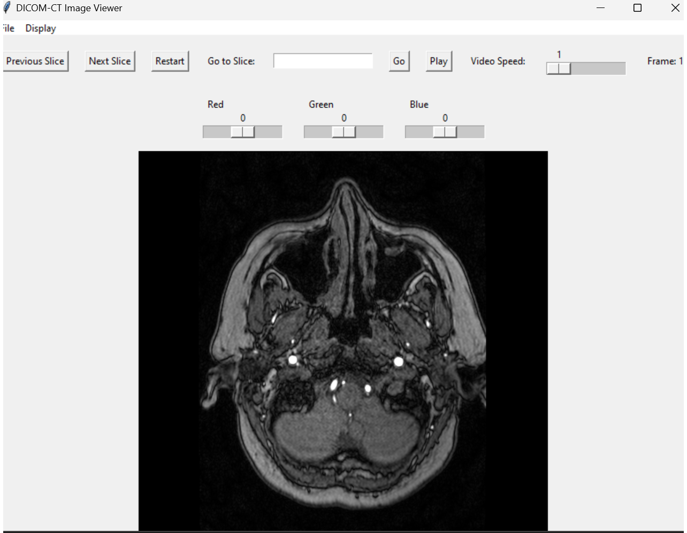

# Explore the data - analysisdata.py

## Overview
This Python script is designed to analyze medical data stored in a SQL Server database and perform various operations such as fetching data, reading data into a DataFrame, plotting data distributions, displaying statistics, and exporting results to Excel.

## Requirements
- Python libraries:
    - `pyodbc`
    - `pandas`
    - `matplotlib`

## Functions
1. **create_connection**: Establishes a connection to the SQL Server database.
2. **fetch_data**: Fetches data from the database using a SQL query.
3. **read_data**: Converts fetched data into a pandas DataFrame.
4. **plot_data**: Plots distributions of gender, age, study description, protocol name, and body part examined.
5. **display_statistics**: Displays descriptive statistics of the data.
6. **write_to_excel**: Writes data, statistics, and distribution plots to an Excel file.
7. **main**: Main menu interface for user interaction.

### Distribution of data

### Body Parts distribution

### Age distribution

### Sex distribution

## DICOM-CT Image Viewer

### Overview
A Python GUI application for viewing DICOM-CT images with features for navigation, color adjustment, and video playback.

### Class: `DICOMViewer`
- **Initialization**: Sets up the application window and initializes attributes.
- **Menu**: Options for opening patient folders and exiting.
- **Frames**: Top and bottom frames for organizing widgets.
- **Buttons**: Navigation, play/pause, and restart buttons.
- **Sliders**: For adjusting color levels.
- **Methods**: Functions for opening folders, navigating slices, adjusting color, and video playback.

### Function: `main`
- Initializes the application.
- Enters the event loop.

### Usage
- Open the viewer.
- Use the menu to select patient folders.
- Navigate slices and adjust colors.
- Play/pause video for sequential viewing.

## ml.py file --- DICOM Image Classification using Convolutional Neural Networks (CNNs)

### Overview
This Python script illustrates DICOM image classification employing CNNs. It establishes a connection to a PostgreSQL database to fetch DICOM images and their associated labels, preprocesses the data, trains a CNN model, evaluates its performance, and makes predictions on new DICOM images.

### Key Components
1. **Database Connectivity**: Establishes a connection to a PostgreSQL database to retrieve DICOM images and labels.

2. **Data Preprocessing**: Normalizes pixel values of DICOM images and encodes disease labels using `LabelEncoder`.

3. **Model Training**: Defines and trains a CNN model using TensorFlow Keras, comprising convolutional and dense layers.

4. **Model Evaluation**: Evaluates the trained model's performance using test data and reports the test accuracy.

5. **Prediction Function**: Defines a function to predict disease types from new DICOM images.

### Workflow
1. **Data Retrieval**: Fetches DICOM images and labels from the database.

2. **Data Partitioning**: Divides the data into training and testing sets.

3. **Model Training**: Trains the CNN model using the training data.

4. **Model Evaluation**: Assesses the model's performance on the test data.

5. **Prediction**: Utilizes the trained model to predict disease types from new DICOM images.

### Usage
1. **Database Setup**: Ensure access to a PostgreSQL database containing DICOM images and labels.

2. **Data Preparation**: Organize DICOM images and labels in the database according to the script's retrieval query.

3. **Script Execution**: Execute the script, providing the necessary database credentials and paths to new DICOM images for prediction.

4. **Interpretation**: Analyze the script's output to evaluate model performance and review predicted disease types.

### Video Generation from DICOM Files with Computer Vision Detection

To create a video from DICOM files with computer vision detection, you can follow these steps:

#### `video.py` File Overview

The `video.py` file is a Python script responsible for generating a video from DICOM files while performing computer vision detection. Below is an overview of its functionality:

1. **Imports**: The script imports necessary libraries for DICOM processing, computer vision, and video generation.

2. **DICOM File Reading**: The script reads DICOM files from a specified folder using libraries like `pydicom`.

3. **Computer Vision Detection**: Computer vision algorithms are applied to the DICOM images for detection tasks such as object detection, image segmentation, or feature extraction. Libraries like OpenCV (`cv2`) are commonly used for this purpose.

4. **Video Generation**: Using the processed DICOM images and detected features, the script generates a video file. This can be accomplished using OpenCV's video writer functionality (`cv2.VideoWriter`).

#### Usage

1. **Setup**: Ensure you have Python installed on your system along with necessary libraries such as `pydicom` and `OpenCV`.

2. **DICOM File Preparation**: Place your DICOM files in a folder accessible to the script.

3. **Script Execution**: Run the `video.py` script. You may need to provide additional parameters such as input folder path, output video path, and detection parameters depending on your implementation.

4. **Video Output**: After script execution, the generated video file will be available at the specified output location. You can review the video to see the results of computer vision detection on the DICOM images.

