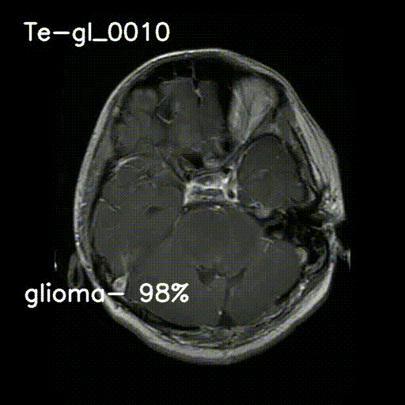

# General Summary of Diverse Projects

## Introduction

This summary highlights a variety of projects spanning different domains, each demonstrating unique functionalities and applications. From cancer detection using convolutional neural networks to video prediction with computer vision, and from image classification pipelines to DICOM image viewers, these projects showcase the versatility and innovation in the field of technology and machine learning.

## Cancer Detection with CNN

A Convolutional Neural Network (CNN) model meticulously crafted for precise cancer detection within medical images. This project employs advanced techniques to analyze and classify image data, enabling accurate identification of potential cancerous abnormalities.

## Video Prediction with Computer Vision

The `videopredict.py` script offers real-time prediction capabilities for analyzing video content, particularly suited for classifying objects or scenes within video frames. Leveraging an ONNX model trained on a deep learning architecture, this script enables seamless inference on video streams, providing insights into the contents of each frame.

## Image Classification Pipeline with Random Forest

A Python script for building an image classification pipeline using the Random Forest algorithm. This pipeline includes image preprocessing, model training, cross-validation, evaluation, and inference functionalities, demonstrating a robust approach to image classification tasks.

## Data Analysis with Python

The `analysisdata.py` script provides comprehensive data analysis tools for exploring medical datasets. From plotting data distributions to displaying statistics, this script empowers users to gain insights into their data and make informed decisions.

## DICOM Image Viewer

A Python GUI application for viewing DICOM-CT images with features for navigation, color adjustment, and video playback. This viewer provides healthcare professionals with a convenient tool for analyzing medical images and facilitating diagnosis.

## Predicting Images with Random Forest

The `predict.py` script utilizes a pre-trained Random Forest Classifier to predict the class labels of images. This versatile tool allows users to predict single images or multiple images in a folder, demonstrating the flexibility of machine learning models in image classification tasks.

## Conclusion

These projects exemplify the diverse applications of machine learning and technology across various domains. From medical imaging to video analysis, data analysis, and image classification, the innovative solutions presented here showcase the potential for technology to drive advancements and improve outcomes in diverse fields.
